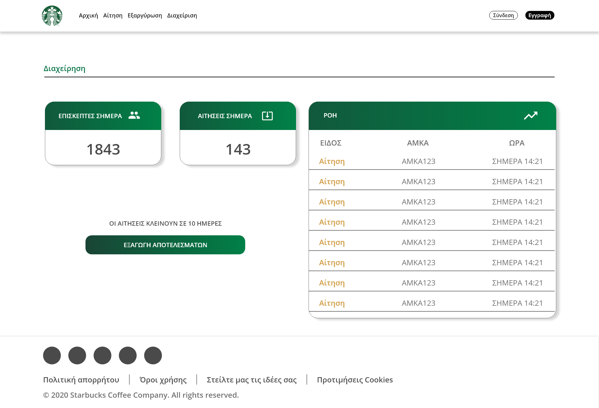

# Starbucks Themed Website - Free Voucher Promotion

<p align="center">
    
</p>

**Visit the website:** [pervolarakis.github.io/starbucks-voucher/](pervolarakis.github.io/starbucks-voucher/)

## Table of Contents

1. [Introduction](#introduction)
2. [Screenshots/Demo](#screenshotsdemo)
3. [Getting Started](#getting-started)
4. [How to Use](#how-to-use)
5. [Contributing](#contributing)
6. [License](#license)

## Introduction

This project was part of my university's UI design course and focuses on creating a Starbucks-themed website with a free voucher promotion feature. The website allows users to apply for free vouchers, and once the promotion period ends, an admin can automatically select and draft the winners. The lucky winners will receive a unique voucher number that they can redeem on the website.

The primary technologies used for this project are Adobe XD for the initial design and React.js with Bootstrap for the implementation.

## Screenshots/Demo

<p align="center">
    
</p>
<p align="center">
    
</p>
<p align="center">
    
</p>

## Getting Started

To run this project locally, follow these steps:

1. Clone the repository to your local machine.
2. Install the required dependencies using npm or yarn.
3. Start the development server to see the project in your browser.

```bash
git clone https://github.com/Pervolarakis/starbucks-voucher.git
cd starbucks-voucher
npm install
npm start
```

## How to Use
1. Homepage: Explore the Starbucks-themed website and learn about the ongoing voucher promotion.

2. Apply for Voucher: Users can participate in the promotion by providing their details on the "Apply for Voucher" page.

3. Redeem Voucher: After the promotion ends, winners will receive a voucher number that they can redeem on the website.

4. Admin Page: Access restricted admin privileges to manage the promotion, select winners, and handle the drafting process.

## Contributing
Contributions to this project are welcome!

## License
This project is licensed under the MIT License.